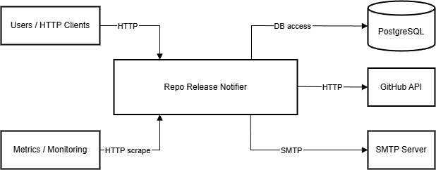
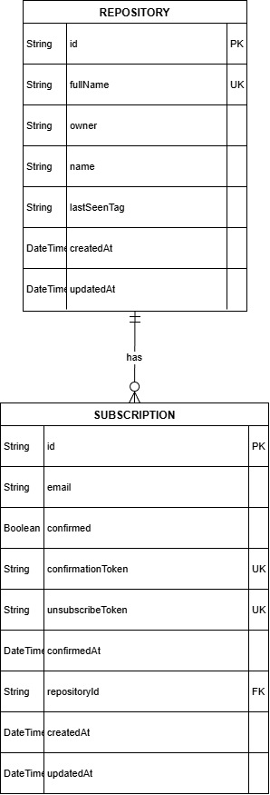

# System Design: Repo Release Notifier

## 1. Вимоги системи

### Функціональні вимоги

- Користувачі можуть підписатися на реліз нових версій GitHub репозиторіїв
- Система повинна надсилати сповіщення про новий реліз, якщо такий існує
- Користувач може відписатися від репозиторію
- Користувач може переглянути усі свої активні підписки
- Система повинна сканувати усі репозиторії на наявність нових релізів в певний проміжок часу(визначається розробником)

### Нефункціональні вимоги

- **Доступність**: 99.9% uptime
- **Масштабованість**: до 10 користувачів, 100 повідомлень/день
- **Безпека**: Надання відповіді лише за наявності API ключа(якщо він ініціалізований)

### Обмеження

- External GitHub API limit:
  60 запитів/годину(без автентифікації) або 5000 запитів/годину(з автентифікацією)
- Бюджет: 0$ (пет проект)

## 2. Оцінка навантаження

- Активні користувачі: 10
- Підписки на користувача: 1-5

## 3. High-level Architecture

## 4. API endpoints

Усі роути префіксовані з використанням `/api`.

| Метод | Ендпоїнт                       | Опис                                                                             |
| ----- | ------------------------------ | -------------------------------------------------------------------------------- |
| POST  | `/subscribe`                   | Підписка на розсилку повідомлень про нові версії для певного репозиторію GitHub. |
| GET   | `/confirm/{token}`             | Підтведження підписки.                                                           |
| POST  | `/unsubscribe/{token}`         | Відписка від розсилки сповіщень про реліз репозиторію.                           |
| GET   | `/subscriptions?email={email}` | Отримання усіх активних підписок для певної поштової скриньки.                   |

Для детальнішої інформації відкрийте [`схему swagger`](../swagger.yaml)

### DB schema

