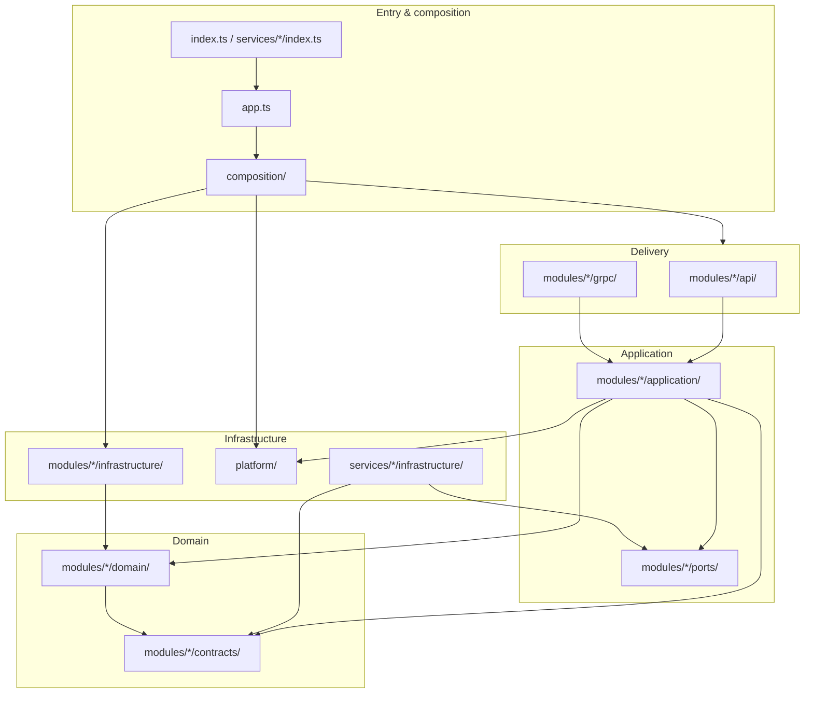

# Layer Breakdown

The codebase follows a **modular monolith** with **hexagonal (ports & adapters)** elements. Layers are expressed as folders inside each bounded context, plus shared `platform`, `composition`, and `services` areas.

Dependency rules are enforced automatically — see [`.dependency-cruiser.cjs`](../../.dependency-cruiser.cjs) and `npm run dep:check`.

## Layer map



## Layers by folder

| Layer | Path pattern | Responsibility | May import |
|-------|--------------|----------------|------------|
| **Domain** | `src/modules/*/domain/` | Entities, value objects, domain services, repository **ports**, domain errors | Same-module domain, `contracts/`, `platform/errors`, `platform/**/ports/` |
| **Contracts** | `src/modules/*/contracts/`, `src/platform/messaging/messages/` | DTOs and payloads shared across layers or services | Standalone types only (no upward deps) |
| **Ports** | `src/modules/*/ports/` | Outbound port interfaces for a module (e.g. scanner adapters) | `contracts/`, platform port types |
| **Application** | `src/modules/*/application/` | Use cases, sagas, orchestration | Domain, contracts, ports, platform errors/ports/messages/saga/scheduling |
| **API / gRPC** | `src/modules/*/api/`, `src/modules/*/grpc/` | HTTP routes, Zod schemas, gRPC handlers | Application, domain, contracts, platform HTTP helpers |
| **Module infrastructure** | `src/modules/*/infrastructure/` | Adapters implementing domain ports (e.g. Prisma repos) | Domain ports, platform persistence |
| **Platform** | `src/platform/` | Shared infra: Prisma client, BullMQ, GitHub, Mailer, saga engine, scheduling | May reach into module **application** only from BullMQ worker factories (composition-style wiring) |
| **Service adapters** | `src/services/*/infrastructure/` | Process-specific outbound adapters (HTTP/gRPC clients) | Module ports, contracts, `gen/` |
| **Composition** | `src/composition/`, `src/app.ts`, `src/index.ts`, `src/services/*/index.ts` | Bootstrap, wire all dependencies | Any layer (wiring only) |
| **Generated** | `src/gen/` | Buf/ts-proto output | Consumed by gRPC delivery and service adapters only |

## Intended dependency flow

```
Entry / composition
    ↓
API / gRPC  →  Application  →  Domain
    ↓              ↓              ↑
Infrastructure ←──┘         Contracts
    ↓
Platform (shared adapters)
    ↓
External systems (PostgreSQL, Redis, GitHub, SMTP)
```

**Inward rule:** dependencies point toward domain and contracts. Outer layers depend on inner abstractions, not the reverse.

**Cross-module rule:** modules communicate only through explicit `contracts/`, `ports/`, BullMQ message schemas, or HTTP/gRPC APIs — never by importing another module's `domain/`, `application/`, `api/`, or `infrastructure/`.

## Module inventory

### `subscription` (full stack)

| Layer | Key files |
|-------|-----------|
| Domain | `RepoValidator`, `SubscriptionMapper`, `UrlBuilder`, `ISubscriptionRepository` |
| Contracts | `scannerContracts.ts`, `subscriptionContracts.ts` |
| Application | `SubscriptionService`, `ScannerAccessService`, `SubscribeSagaOrchestrator` |
| API | `subscriptionRoutes`, `scannerInternalRoutes`, Zod schemas |
| gRPC | `scannerAccessGrpcHandlers`, `scannerAccessGrpcServer` |
| Infrastructure | `SubscriptionRepository`, `RepositoryRepository` (Prisma) |

### `release-scanner` (application + ports)

| Layer | Key files |
|-------|-----------|
| Ports | `ScanTargetProvider`, `RepositoryStateUpdater` |
| Application | `ReleaseScannerService`, `ReleaseDetector`, `ReleaseNotificationPublisher` |
| Adapters (in `src/services/release-scanner/infrastructure/`) | HTTP and gRPC clients to subscription API |

### `notification` (application only)

| Layer | Key files |
|-------|-----------|
| Application | `NotificationConsumer`, `sendConfirmation`, `notifyNewRelease` |
| Worker wiring (in `src/platform/messaging/bullmq/`) | `createNotificationWorker` |

## Enforced rules

These constraints are checked by dependency-cruiser on every `npm test` run:

| Rule | Description |
|------|-------------|
| `no-domain-to-api` | Domain must not import API/gRPC delivery code |
| `no-application-to-api` | Application must not import API/gRPC delivery code |
| `no-domain-to-infrastructure` | Domain must not import infrastructure adapters |
| `no-application-to-infrastructure` | Application must not import infrastructure adapters |
| `no-api-to-infrastructure` | API/gRPC must not import infrastructure directly |
| `no-domain-to-prisma` | Domain must not import `@prisma/client` |
| `no-application-to-prisma` | Application must not import `@prisma/client` |
| `no-cross-module-internals` | Modules may not import another module's domain/application/api/infrastructure/grpc |
| `no-modules-to-services` | Shared modules must not depend on process entry adapters |
| `no-domain-to-platform-concrete` | Domain may only use `platform/errors` and `platform/**/ports/` |
| `no-application-to-platform-concrete` | Application may use platform errors, ports, messages, saga, scheduling, and logger interfaces — not persistence, BullMQ impls, or concrete integrations |

## Shared kernel exceptions

Some platform packages act as a **shared kernel** accessible from inner layers:

- **`platform/errors`** — typed application errors (`ResourceNotFoundError`, `OptimisticLockError`, …)
- **`platform/**/ports/`** — outbound port interfaces (`ISourceControlClient`, `INotificationPublisher`, …)
- **`platform/messaging/messages/`** — job payload types consumed by notification handlers
- **`platform/saga/types`** and **`platform/saga/SagaOrchestrator`** — saga framework used by subscribe flow
- **`platform/scheduling/`** — `ScheduledTask`, `RateLimitPauser` utilities used by release scanner

Concrete implementations (`GitHubClient`, `Mailer`, `prisma`, BullMQ publishers) are wired only from **composition** or **infrastructure** layers.

## DTO placement

Request/response shapes shared between application and API live in **`contracts/`** (e.g. `SubscribeInput`, `SubscriptionResponse` in `subscriptionContracts.ts`). API route schemas (Zod) stay in `api/schemas/`; they validate HTTP input but application services depend on contract types, not route modules.

## Adding a new feature

1. Add or extend domain models and ports in `src/modules/<module>/domain/`.
2. Implement the application service in `src/modules/<module>/application/` (e.g. `SubscriptionService`, `ReleaseDetector`).
3. Expose via `src/modules/<module>/api/` or `grpc/` routes.
4. Add Prisma or external adapters in `src/modules/<module>/infrastructure/` or `src/services/<process>/infrastructure/`.
5. Wire dependencies in `src/composition/` or the relevant `src/services/<process>/index.ts`.
6. If a new cross-service type is needed, add it to `src/modules/<module>/contracts/` or `src/platform/messaging/messages/`.
7. Run `npm run dep:check` to confirm layer boundaries hold.
