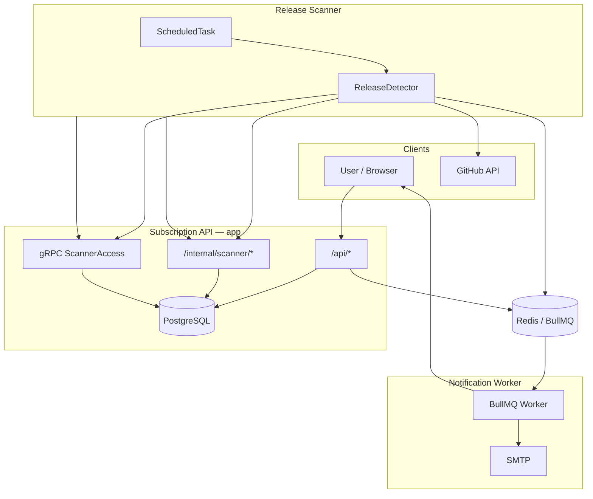

# Application Architecture

Repo Release Notifier is a **TypeScript modular monolith** deployed as **three Node.js processes** from a single codebase. Bounded contexts live under `src/modules/`; shared infrastructure under `src/platform/`; process-specific wiring under `src/composition/` and `src/services/`.

For layer rules and enforced dependency constraints, see [layers.md](./layers.md).

## Runtime topology



| Process | Entry point | Ports | Database | Role |
|---------|-------------|-------|----------|------|
| Subscription API | [`src/index.ts`](../../src/index.ts) | 3000 HTTP, 50051 gRPC | Yes | Public API, scanner internal API, saga orchestration |
| Release scanner | [`src/services/release-scanner/index.ts`](../../src/services/release-scanner/index.ts) | 3002 health | No | Poll GitHub, detect releases, enqueue notifications |
| Notification worker | [`src/services/notification/index.ts`](../../src/services/notification/index.ts) | health | No | Consume BullMQ jobs, send email |

All three share one Docker image; `docker-compose.yml` selects the start command per container.

## Source layout

```
src/
├── index.ts, app.ts          # Subscription API bootstrap
├── composition/              # Dependency wiring (composition root)
├── modules/                  # Bounded contexts (vertical slices)
│   ├── subscription/         # api, application, domain, infrastructure, grpc, contracts
│   ├── release-scanner/      # application, ports (adapters in src/services/)
│   └── notification/         # application handlers + consumer
├── platform/                 # Cross-cutting infrastructure
│   ├── config, errors, http, logger, persistence
│   ├── integrations/         # GitHub, Mailer + ports
│   ├── messaging/            # BullMQ, job schemas, ports
│   ├── saga/                   # Saga engine + Prisma store
│   └── scheduling/             # ScheduledTask, RateLimitPauser
├── services/                 # Secondary process entry points + adapters
│   ├── release-scanner/      # HTTP/gRPC clients to subscription API
│   └── notification/         # Worker bootstrap
└── gen/                      # Buf-generated gRPC types
```

## Bounded contexts

### Subscription

Owns repositories, subscriptions, and saga state. Exposes:

- Public HTTP `/api/*` — subscribe, confirm, unsubscribe, list subscriptions
- Internal HTTP `/internal/scanner/*` — scan targets and optimistic `lastSeenTag` updates
- Optional gRPC `ScannerAccessService` — same scanner operations over RPC

Key flows:

1. **Subscribe** — `POST /api/subscribe` → `SubscriptionService` → `RepoValidator` (GitHub) → `SubscribeSagaOrchestrator` → persist + enqueue confirmation email
2. **Scanner access** — `ScannerAccessService` reads confirmed subscriptions and applies optimistic locking on tag updates

### Release scanner

Stateless worker that polls GitHub for new release tags. Has **no database access** ([ADR-004](../ADR/ADR-004-release-scanner-microservice.md)); reads targets and updates state through the subscription API (HTTP or gRPC).

Flow: `ReleaseScannerService` → `ScheduledTask` → `ReleaseDetector` → GitHub + API/gRPC → `ReleaseNotificationPublisher` → BullMQ.

Scanner-side adapters (`HttpScanTargetProvider`, `GrpcScanTargetProvider`, etc.) live in [`src/services/release-scanner/infrastructure/`](../../src/services/release-scanner/infrastructure/) because they are process-specific delivery mechanisms, not subscription domain logic.

### Notification

Handles async email delivery. `NotificationConsumer` dispatches BullMQ jobs to `sendConfirmation` and `notifyNewRelease` handlers using the shared `Mailer`.

## Cross-boundary communication

| From | To | Mechanism | Contract |
|------|----|-----------|----------|
| Release scanner | Subscription API | HTTP `/internal/scanner/*` or gRPC | [`scannerContracts.ts`](../../src/modules/subscription/contracts/scannerContracts.ts), [`scanner_access.proto`](../../proto/scanner/v1/scanner_access.proto) |
| Subscription / scanner | Notification worker | BullMQ queue `notifications` | [`notificationJobs.ts`](../../src/platform/messaging/messages/notificationJobs.ts) |
| All modules | Platform | Direct imports of ports, errors, shared utilities | Platform ports under `src/platform/**/ports/` |

## Composition and dependency injection

[`createSubscriptionModule()`](../../src/composition/createSubscriptionModule.ts) is the composition root for the API process: it instantiates Prisma repositories, GitHub client, BullMQ publishers, saga orchestrator, and wires them into application services and Fastify plugins.

Scanner and notification processes bootstrap similarly in their respective `src/services/*/index.ts` entry points, importing application services and injecting HTTP/gRPC or BullMQ adapters.

## Data stores

| Store | Used by | Purpose |
|-------|---------|---------|
| PostgreSQL | Subscription API only | `Repository`, `Subscription`, `SagaInstance` (Prisma) |
| Redis | API, scanner, notification | BullMQ queues for notifications and saga steps |
| GitHub API | API (validation), scanner (release detection) | Repository and release metadata |
| SMTP | Notification worker | Email delivery |

## Patterns in use

- **Vertical slices** — each module groups api, application, domain, and (where needed) infrastructure
- **Ports and adapters** — `ISubscriptionRepository`, `ScanTargetProvider`, `INotificationPublisher`, `ISourceControlClient`
- **Saga** — `SubscribeSagaOrchestrator` coordinates subscription persistence and confirmation email via `SagaOrchestrator` + BullMQ participant
- **Optimistic locking** — `lastSeenTag` updates use version checks; conflicts return HTTP `409` / gRPC `ABORTED`
- **Async notifications** — API and scanner publish jobs; notification worker consumes them independently

## Related documentation

| Document | Description |
|----------|-------------|
| [layers.md](./layers.md) | Layer breakdown and dependency rules |
| [SDR](../SDR/SDR.md) | System requirements, load estimates, API tables |
| [ADR index](../ADR/) | Technology and service-boundary decisions |
| [Observability](../observability/) | Logging (ELK) and metrics (Prometheus/Grafana) |
| [swagger.yaml](../../swagger.yaml) | OpenAPI schema for public API |

## Architecture tests

Layer dependency rules are enforced by [dependency-cruiser](https://github.com/sverweij/dependency-cruiser) in CI (`npm run dep:check`). Run locally:

```bash
npm run dep:check
```
